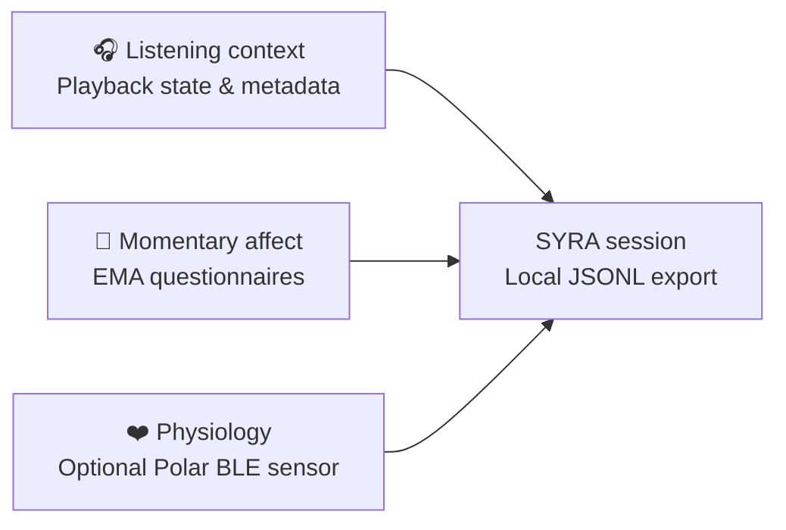

<p align="center">
  
</p>

<h1 align="center">SYRA</h1>

<p align="center">
  <strong>Signal-based Yield for Responses to Audio</strong><br />
  A research tool for understanding how people respond to audio in everyday life.
</p>

<p align="center">
  
  
  
  
</p>

<p align="center">
  <a href="#getting-started">Get started</a> |
  <a href="#usage">Usage</a> |
  <a href="#quality--privacy">Privacy</a>
</p>

> [!IMPORTANT]
> SYRA is a research prototype and is not intended to diagnose, treat, or monitor a health condition.

## Why SYRA?

Music-and-emotion studies often use short, researcher-selected excerpts in controlled labs. That gives researchers useful control, but it can leave out the everyday moments when people choose music, live with it, and use it to shape how they feel.

SYRA is built for those everyday moments. It keeps data collection on the participant's device and brings momentary self-report, listening context, and optional wearable data together in one exportable session.



### Research questions it supports

| Focus | Example question |
| --- | --- |
| **Naturalistic listening** | How do people respond to self-selected audio on their own devices? |
| **Physiological response** | How do heart rate, motion, and compatible biosignals change during listening? |
| **Emotion regulation** | How do affect and listening goals relate to music use in daily life? |

## Features

| Capability | What SYRA provides |
| --- | --- |
| **Wearable integration** | Records heart rate, ECG, accelerometer, and compatible PPG streams from Polar BLE devices. |
| **Music context** | Watches playback and metadata from supported music apps through Android `MediaSessionManager`. |
| **EMA protocols** | Runs pre-listening, post-listening, and scheduled random questionnaires, including valence-arousal reporting. |
| **Study modes** | Supports music-triggered, random ESM, and physiology-focused protocols. |
| **Local-first storage** | Saves JSONL session data and encrypted study metadata locally, then exports a ZIP when you are ready. |
| **Background collection** | Uses a foreground sensor service and alarm-based prompts where Android permits background operation. |

## Built with

`Kotlin` · `Jetpack Compose` · `Coroutines` · `Room + SQLCipher` · `Polar BLE SDK` · `Android MediaSession` · `AlarmManager`

| Requirement | Supported configuration |
| --- | --- |
| Android version | Android 7.0+ (API 24) |
| Compile / target SDK | Android SDK 35 |
| JVM target | Java 11 |
| Wearables | Polar H10, OH1+, Verity Sense, and compatible devices |

## Getting started

### Prerequisites

- Android Studio with an installed Android SDK and a JDK compatible with the project’s Java 11 target.
- An Android 7.0+ device for deployment and testing.
- A compatible Polar BLE sensor for physiology collection.
- A supported music app for music-triggered studies.

### Install

```bash
git clone git@github.com:Harizz076/SYRA.git
cd SYRA/app

# Build and install a debug APK on a connected Android device
./gradlew assembleDebug
./gradlew installDebug
```

Alternatively, open the `app/` directory in Android Studio, allow Gradle to sync, and run the `debug` configuration on a connected device.

### First-run checklist

1. Enter a participant identifier and choose a study mode.
2. Select a local storage location for session exports.
3. Grant Bluetooth and notification permissions when prompted.
4. For music-triggered modes, enable **Notification Access** for SYRA in Android Settings.
5. If prompted, exempt SYRA from battery optimisation to reduce OEM background restrictions.

## Usage

Choose the protocol that matches your study design:

| Mode | Behaviour | Sensor required |
| --- | --- | :---: |
| **Triggered** | Starts a session when a supported music app begins playing. | No |
| **Triggered + Random ESM** | Combines playback-triggered sessions with scheduled prompts. | No |
| **Random ESM** | Sends scheduled affect prompts without media monitoring. | No |
| **Physiology** | Records supported streams from a connected Polar sensor. | Yes |

For a music-triggered session, choose a mode, start listening in a supported app, answer the pre-session prompt, and listen normally. When playback ends, answer the post-session prompt and export the session from the app settings.

### Export format

SYRA exports a ZIP archive containing JSONL files such as:

```text
session-export.zip
├── ECG.jsonl          # Raw ECG samples, when available
├── ACC.jsonl          # Accelerometer samples, when available
├── track_info.jsonl   # Playback-state and track-metadata events
├── pre.jsonl          # Pre-session affect responses
├── post.jsonl         # Post-session affect and music-experience responses
└── LOG.jsonl          # Application diagnostic events
```

> [!CAUTION]
> Exports can contain sensitive physiological and self-report data. Handle them only under an ethics-approved protocol and your institution’s data-governance requirements.

## Project structure

```text
SYRA/
├── app/                           # Android Studio / Gradle project
│   └── app/src/main/
│       ├── java/                  # App, services, managers, UI, and persistence
│       ├── assets/questionnaires/ # JSON-defined questionnaires
│       └── res/                   # Android resources
├── LICENSE
├── NOTICE                          # Required third-party attribution
└── README.md
```

## Quality & privacy

- SYRA is local-first. It does not declare the Android `INTERNET` permission.
- Run unit tests from `app/` with `./gradlew testDebugUnitTest`.
- Run static analysis from `app/` with `./gradlew detekt`.
- Device logs, pilot-session reports, and other research diagnostics are intentionally excluded from version control.

## License

SYRA is released under the [MIT License](LICENSE). See [NOTICE](NOTICE) for third-party and upstream attribution information that must be retained in redistributions.

## Contact

Have a question, an idea, or a bug to report? Open a [GitHub issue](https://github.com/Harizz076/SYRA/issues) or email [shaikh.jamal@research.iiit.ac.in](mailto:shaikh.jamal@research.iiit.ac.in).

## Acknowledgements

- [Polar Electro](https://github.com/polarofficial/polar-ble-sdk) for the Polar BLE SDK.
